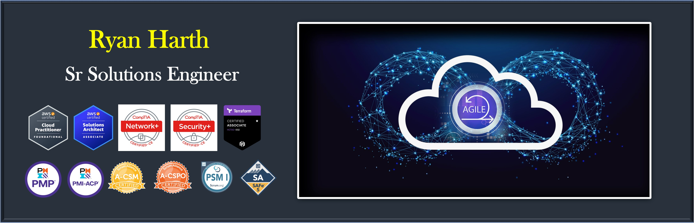

## < WELCOME TO MY PAGE! >
                
## My last professional role was Sr DevSecOps Manager (Deputy Director) for the US Army Special Operations Command - Artificial Intelligence Division

## Currently, I am a in the process of transitioning from active duty in the US Army and looking for my next role in the Cloud/DevOps ecosphere. 

            
## I am an AWS Certified Solutions Architect ☁️, Hashicorp Certified: Teraform Associate, and DevOps practitioner ♾️    
  
  
## Connect with me on  [LinkedIn](https://www.linkedin.com/in/ryan-m-harth/)

# MY PROJECTS
### - [NPS Thesis](https://calhoun.nps.edu/handle/10945/61341)
### - [Viloent Crime in America Project](https://drive.google.com/file/d/1T_kxDkPaK_rU1fyFrs26KKQpWPvzwvxG/view?usp=sharing)
