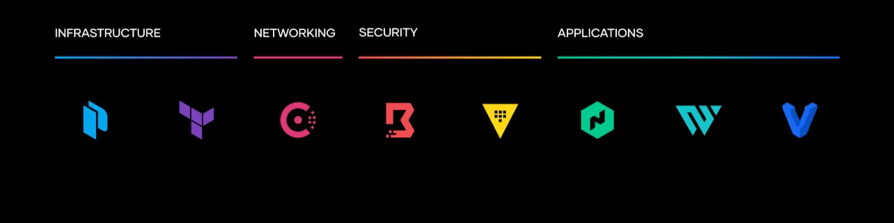

## < WELCOME TO MY PAGE! >

## I am an experienced DevOps & Cloud Solutions Engineer with extensive GovTech domain expertise. 

## Previously, I was Deputy Director & Sr DevSecOps Manager for the US Army Special Operations Command - Artificial Intelligence Division  

## I am passionate about architecting creative solutions that leverage IaC, the cloud, and project/program best practices, to deliver REAL BUSINESS VALUE for customers and stakeholders 

## I am an AWS Certified Solutions Architect ☁️, Hashicorp Certified: Teraform Associate, and DevOps practitioner ♾️    

## I am a Force Recon Marine, Green Beret Veteran, and ultra runner.
            
## Connect with me on  [LinkedIn](https://www.linkedin.com/in/ryan-m-harth/)

# MY PROJECTS
### - [NPS Thesis](https://calhoun.nps.edu/handle/10945/61341)
### - [Viloent Crime in America Project](https://drive.google.com/file/d/1T_kxDkPaK_rU1fyFrs26KKQpWPvzwvxG/view?usp=sharing)
